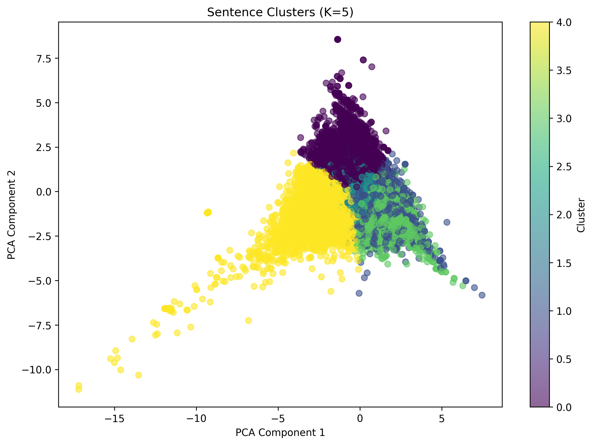
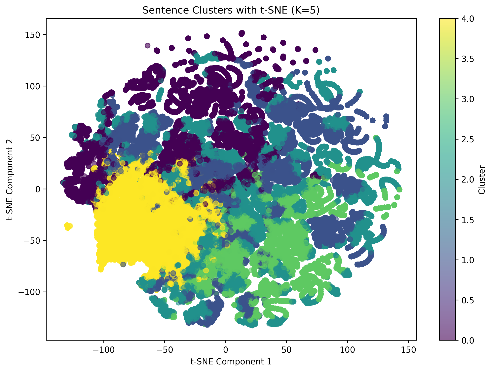

# Sentence Complexity Clustering on Learner Texts

This project explores unsupervised clustering of L2-written sentences based on syntactic and lexical complexity features.  
The goal is to discover sentence-level writing patterns across proficiency levels using clustering and visualization techniques.

---

## Project Motivation

This work was developed as part of a personal NLP research portfolio to showcase data preprocessing, feature engineering, and unsupervised learning skills on real-world L2 language data.  
The project builds on previous research into syntactic complexity in second language writing.

---

## Methodology

The pipeline includes:
1. **Data Cleaning & Sentence Splitting**  
2. **Feature Engineering**  
   - Sentence length
   - Type-Token Ratio (TTR)
   - POS ratios (noun, verb, adjective)
   - Syntactic depth (dependency distance)
3. **Feature Correlation Analysis**
4. **Dimensionality Reduction**
   - PCA
   - t-SNE (for visualization)
5. **Clustering**
   - KMeans clustering of sentence features
6. **Interpretation**
   - Example sentences + feature averages per cluster

All steps were implemented manually in Python without external linguistic toolkits (like TAASSC) to demonstrate full control over feature engineering.

---

## Data

This project uses L2 essays from the [ICNALE corpus](https://language.sakura.ne.jp/icnale/), a publicly available collection of English essays written by second language users.  

**Note:**  
The ICNALE dataset is **not included** in this repository due to licensing restrictions.  
To reproduce the full pipeline, please request access and download the dataset from the official ICNALE website linked above.  
Once obtained, place the dataset files in `data/raw/` as described in `data/raw/README.md`.

---

## Results

Two main visualizations were created:
1. 
2.   
   

Both plots show distinct sentence clusters that broadly reflect sentence complexity differences.

You can find these plots in `outputs/figures/`.

---
